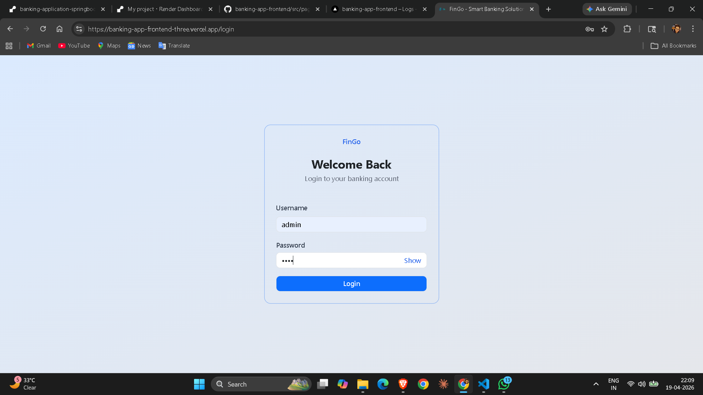
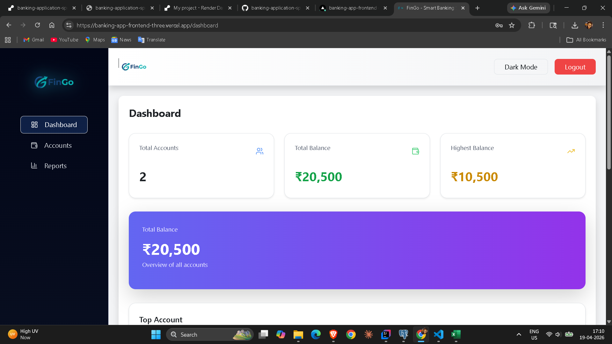
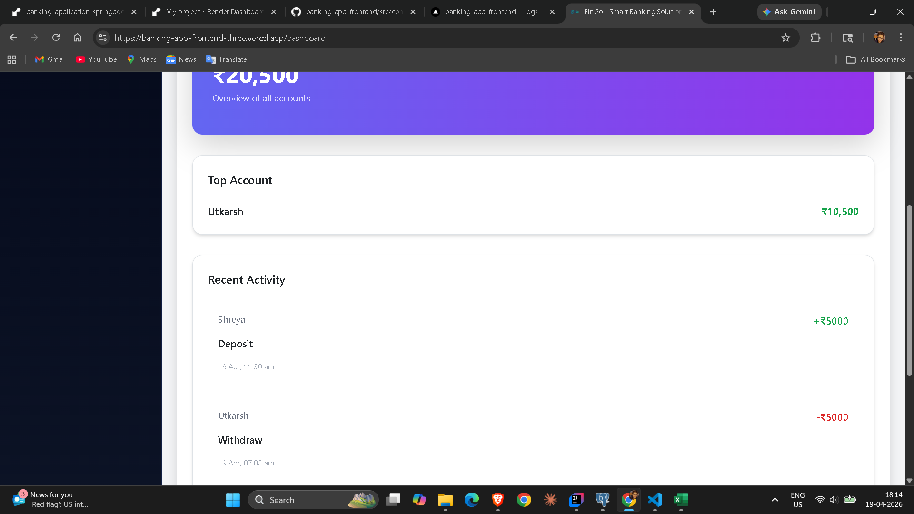
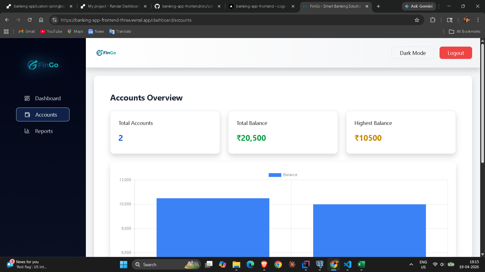
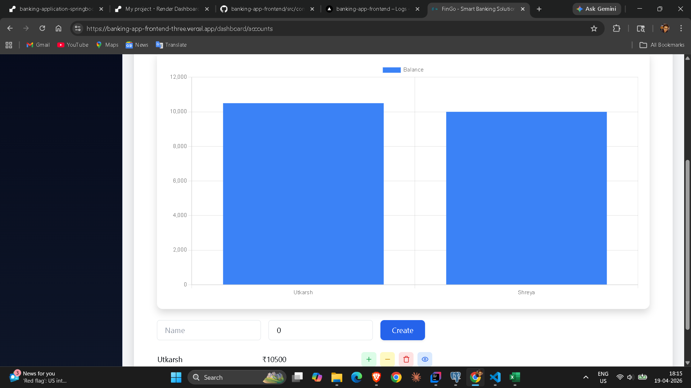
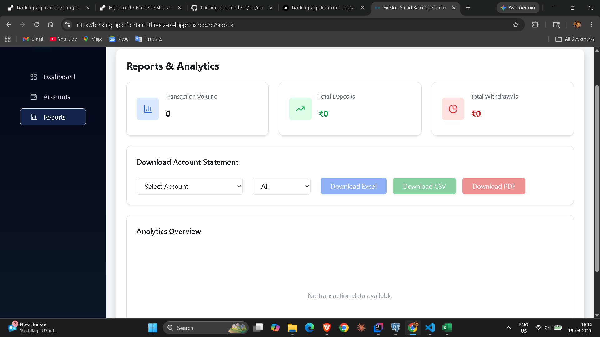
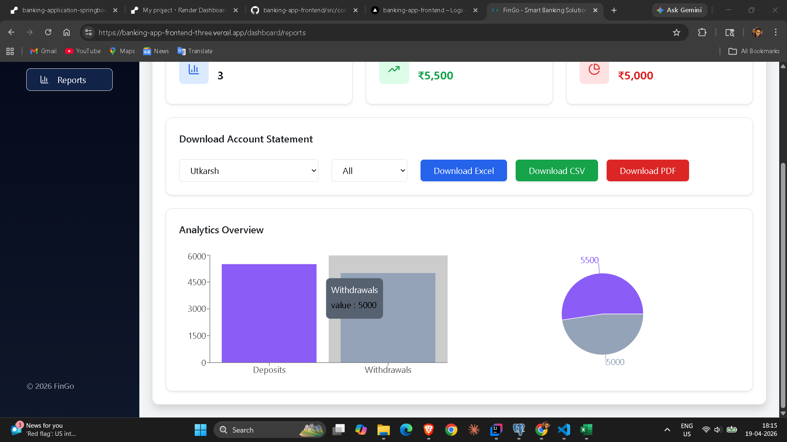

# 💳 FinGo – Smart Banking Admin Dashboard (Frontend)

A modern, responsive banking admin dashboard built using React, Vite, Tailwind CSS, Axios, and Chart.js.  
This application connects to a Spring Boot backend and provides real-time account management, transaction tracking, and analytics visualization.

---

## 🌐 Live Deployment

- Frontend (Vercel): https://banking-app-frontend-three.vercel.app/
- Backend (Render): https://banking-application-springboot.onrender.com

---

## 🚀 Features

Authentication:
- Admin Login with JWT authentication
- Protected routes using React Router
- Secure logout functionality

Dashboard:
- Sidebar navigation (Admin Panel)
- Dark Mode toggle
- Summary cards:
  - Total Accounts
  - Total Balance
  - Highest Balance
- Recent Activity tracking

Account Management:
- Create new accounts
- Deposit money
- Withdraw money
- Delete accounts
- Search accounts by name
- Real-time UI updates

Transaction History:
- View account-wise transactions
- Timestamp-based activity logs
- Instant updates after operations

Reports & Analytics:
- Bar charts for account balances
- Deposit vs Withdrawal comparison
- Interactive charts using Chart.js
- Download reports:
  - Excel
  - CSV
  - PDF

---

## 🏗 Project Structure

src/
│
├── components/
│   └── AccountList.jsx
│
├── layout/
│   └── Layout.jsx
│
├── pages/
│   ├── Login.jsx
│   ├── Dashboard.jsx
│   ├── Accounts.jsx
│   └── Reports.jsx
│
├── services/
│   └── AccountService.js
│
├── App.jsx
├── main.jsx

Architecture Patterns Used:
- Layout-based routing
- Nested routes
- Service/API abstraction
- Component-based structure
- State management using React Hooks

---

## 🧱 Tech Stack

- React (Vite)
- Tailwind CSS
- React Router
- Axios
- Chart.js
- JavaScript (ES6+)

---

## 📸 Screenshots

Login Page:

Dashboard:

Accounts Page:

Reports & Analytics:

---

## 🔗 Backend Integration

https://banking-application-springboot.onrender.com

---

## 🌍 Environment Variables

Create a .env file:

VITE_API_BASE_URL=https://banking-application-springboot.onrender.com

---

## ⚙️ How To Run Locally

git clone https://github.com/UtkarshPardhi/banking-app-frontend.git  
cd banking-app-frontend  
npm install  
npm run dev  

App runs on:  
http://localhost:5173  

---

## 🎨 UI Highlights

- Gradient sidebar design
- Clean top navigation bar
- Fully responsive layout
- Modern card-based UI
- Dark mode support
- Interactive charts

---

## 🔮 Future Improvements

- Role-based authentication (Admin/User)
- Pagination & sorting
- Advanced analytics dashboard
- Notifications (toast system)
- Performance optimization

---

## 👨‍💻 Author

Utkarsh Pardhi  
Full Stack Developer  

LinkedIn: https://www.linkedin.com/in/utkarsh-pardhi-26b8a0257  
GitHub: https://github.com/UtkarshPardhi  

---

If you like this project, give it a star on GitHub!
